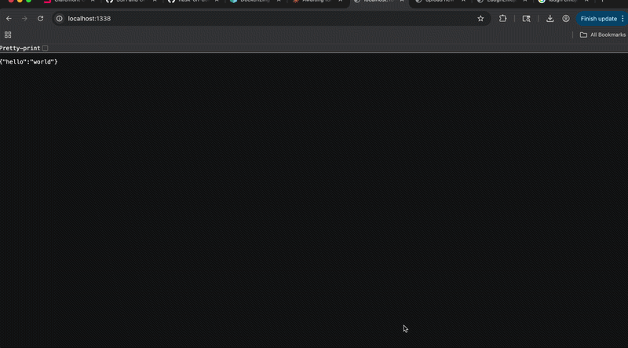

# Flask on Docker

[](https://github.com/Mateenmok/flask-on-docker/actions/workflows/main.yml)

## Overview

This repository demonstrates a fully containerized Flask web application using a modified Instagram tech stack. The app integrates Flask, PostgreSQL, Gunicorn, and Nginx using Docker and Docker Compose. It supports user data persistence via a PostgreSQL database, serves static files, and allows users to upload and view media files through a simple web interface.



## Build Instructions

### Development

Build and run the development containers:
```bash
docker compose up -d --build
docker compose exec web python manage.py create_db
```

The app will be available at http://localhost:9878.

### Production

Build and run the production containers:
```bash
docker compose -f docker-compose.prod.yml up -d --build
docker compose -f docker-compose.prod.yml exec web python manage.py create_db
```

The app will be available at http://localhost:1338.

- Upload a file at http://localhost:1338/upload
- View uploaded file at http://localhost:1338/media/IMAGE_FILE_NAME
- View static files at http://localhost:1338/static/hello.txt
